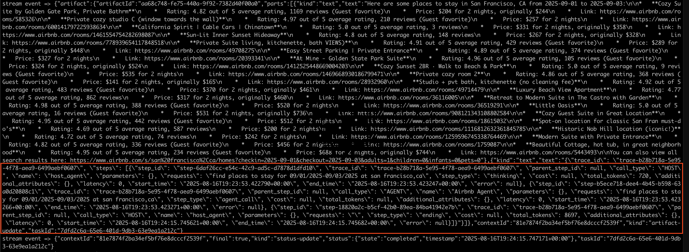

# Build Multi-Agent Systems using A2A SDK

----
> **⚠️ DISCLAIMER**: THIS DEMO IS INTENDED FOR DEMONSTRATION PURPOSES ONLY. IT IS NOT INTENDED FOR USE IN A PRODUCTION ENVIRONMENT.
>
> **⚠️ Important:** A2A is a work in progress (WIP) thus, in the near future there might be changes that are different from what demonstrated here.
----

This document describes a multi-agent set up using Agent2Agent (A2A) and a example traceability extension implementation for the hosting agents and how the extension is activated on the server and included in the response.

## Architecture

The application utilizes a multi-agent architecture where a host A2A server delegates tasks to remote A2A servers (Airbnb and Weather) based on the user's query. These agents then interact using A2A proto. These A2A servers are built based ADK. We then use the CLI tool talk to the host A2A server also using A2A proto. 


### App UI



## Setup and Deployment

### Prerequisites

Before running the application locally, ensure you have the following installed:

1. **Node.js:** Required to run the Airbnb MCP server (if testing its functionality locally).
2. **uv:** The Python package management tool used in this project. Follow the installation guide: [https://docs.astral.sh/uv/getting-started/installation/](https://docs.astral.sh/uv/getting-started/installation/)
3. **Python 3.13** Python 3.13 is required to run a2a-sdk
4. **set up .env**

- Create a `.env` file in `samples/python/agents/airbnb_planner_multiagent/airbnb_agent` and `samples/python/agents/airbnb_planner_multiagent/weather_agent` folder with the following content:

    ```bash
    GOOGLE_API_KEY="your_api_key_here" 
    ```

- Create `.env` file in current folder with the following content:

    ```bash
    GOOGLE_GENAI_USE_VERTEXAI=TRUE
    GOOGLE_CLOUD_PROJECT="your project"
    GOOGLE_CLOUD_LOCATION=global
    AIR_AGENT_URL=http://localhost:10002
    WEA_AGENT_URL=http://localhost:10001
    ```

## 1. Run Airbnb Agent

Run the airbnb A2A agent server:

```bash
cd samples/python/agents/airbnb_planner_multiagent/airbnb_agent
uv run .
```

This will starts the airbnb A2A server (port 10002).

## 2. Run Weather A2A Agent

Open a new terminal and run the weather agent server:

```bash
cd samples/python/agents/airbnb_planner_multiagent/weather_agent
uv run .
```
This will starts the airbnb A2A server (port 10001).

## 3. Run Host A2A Agent

Open a new terminal and run the host agent server

```bash
cd samples/python/host/a2a_multiagent
uv run .
```
This will starts the A2A Host server (port 8083).

## 4. Run the CLI Tool
```bash
cd samples/python/hosts/cli
uv run . --agent http://localhost:8083
```

Here are example questions:

- "Tell me about weather in LA, CA"  

- "Please find a room in LA, CA, June 20-25, 2025, two adults"

The response should include the traceability extension as additional artifact included. Please see the example screenshot above.
We can also include the traceability information as metadata in the response.

## References

- <https://github.com/google/a2a-python>
- <https://codelabs.developers.google.com/intro-a2a-purchasing-concierge#1>
- <https://google.github.io/adk-docs/>

## Disclaimer

Important: The sample code provided is for demonstration purposes and illustrates the mechanics of the Agent-to-Agent (A2A) protocol. When building production applications, it is critical to treat any agent operating outside of your direct control as a potentially untrusted entity.

All data received from an external agent—including but not limited to its AgentCard, messages, artifacts, and task statuses—should be handled as untrusted input. For example, a malicious agent could provide an AgentCard containing crafted data in its fields (e.g., description, name, skills.description). 

If this data is used without sanitization to construct prompts for a Large Language Model (LLM), it could expose your application to prompt injection attacks.  Failure to properly validate and sanitize this data before use can introduce security vulnerabilities into your application.

Developers are responsible for implementing appropriate security measures, such as input validation and secure handling of credentials to protect their systems and users.
